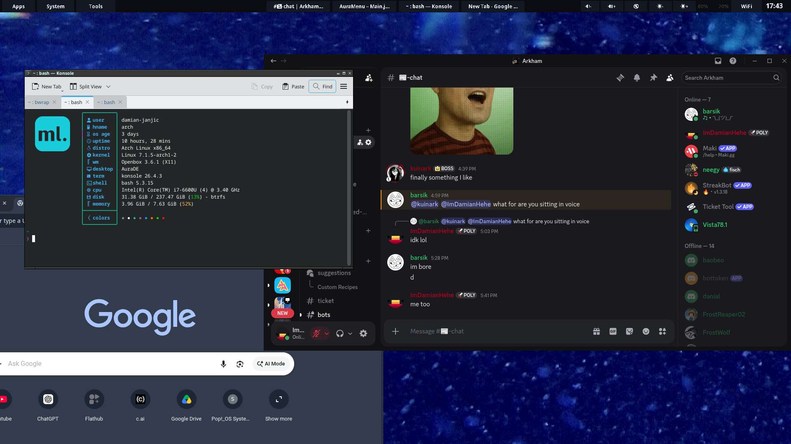

AuraDE-Linux

AuraDE is a small Linux desktop environment (DE) project written in Java, aiming to provide a blend of classic and modern desktop ideas.

Warning
AuraDE is still in early development and is currently maintained by one developer. Expect missing features, bugs, and rough edges.

Manual installation only for now

## Screenshot



# How to install:

### Step 1: copy the files

To do that, you need to Download all the files in https://github.com/ImDamianHehe/AuraDE-Linux/tree/main/jar%20file(s) then do these commands:

## Create Directories

```bash
mkdir -p ~/.local/bin
mkdir -p ~/.local/aurade
mkdir -p ~/.AuraMass
```

## Copy files

```bash
cp -r /path/to/auramass ~/.local/bin/auramass
sudo cp -r /path/to/start-aurade /usr/local/bin/start-aurade
cp -r /path/to/auramass.jar ~/.AuraMass/auramass.jar
cp -r /path/to/aurade.jar ~/.local/aurade/aurade.jar
sudo cp -r /path/to/aurade.desktop /usr/share/xsessions/aurade.desktop
```

## Optional files to copy

```bash
cp -r /path/to/wallpaper.jpg ~/.local/aurade/wallpaper.jpg
```

## Make files executable

```bash
chmod +x ~/.local/bin/auramass
sudo chmod +x /usr/local/bin/start-aurade
```

### Step 2: Install packages
## Required packages to install

## Arch Linux:

```bash
sudo pacman -S \
xorg-server \
xorg-xinit \
xorg-xrandr \
xorg-xsetroot \
xorg-xprop \
openbox \
firefox \
less \
jre-openjdk \
feh \
tint2 \
pcmanfm \
dbus \
xdg-utils \
xdg-user-dirs \
ttf-dejavu \
ttf-liberation \
sddm
konsole
```

## Ubuntu:

```bash
sudo apt install -y \
xorg \
xinit \
x11-xserver-utils \
x11-utils \
x11-xkb-utils \
openbox \
firefox \
less \
default-jre \
feh \
tint2 \
pcmanfm \
xdg-utils \
xdg-user-dirs \
fonts-dejavu \
fonts-liberation \
sddm
konsole
```

## Optional packages

`obconf` or `obconf-qt` (for window decoration themes, etc.)

### Step 3: enable the services:

```bash
sudo systemctl enable sddm.service
sudo systemctl start sddm.service
```

## You're done! now reboot to SDDM so you can enter the DE (Desktop Enviroment):
```bash
sudo reboot
```
or
```bash
reboot
```

# Important

**AuraMass** is the terminal emulator used by AuraDE and is currently the **only supported terminal emulator**. At the moment, AuraDE does not provide a way to change the default terminal, so **AuraMass is required for a functional AuraDE installation**.

And you can type ```konsole``` in AuraMass terminal to get KDE's terminal if you have installed konsole.

# Additional information

AuraMass is a terminal emulator and the default terminal emulator for AuraDE.

After rebooting, select AuraDE from the SDDM session menu before logging in.
